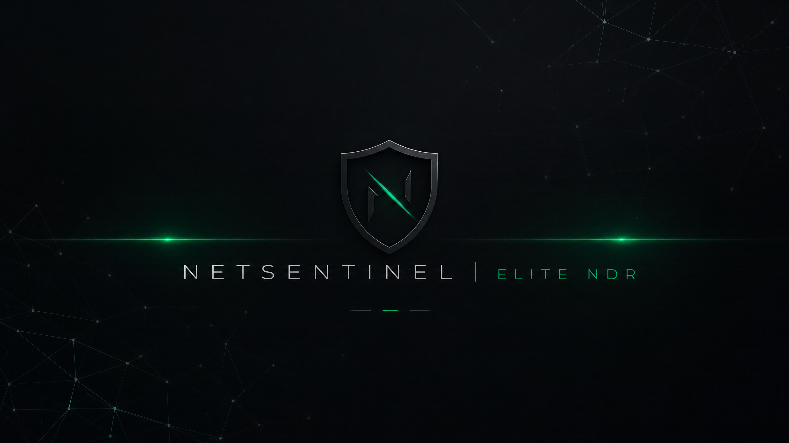
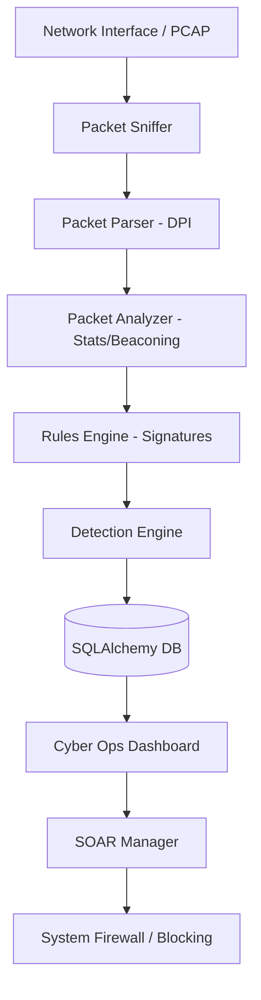

<p align="center">
  
</p>

#  NetSentinel: Cyber Ops NDR & Forensic Platform

NetSentinel is a professional-grade, "mferge3" (explosive) Network Detection and Response (NDR) platform designed for senior cybersecurity engineers and pentesters. It combines deep packet inspection (DPI), advanced traffic pattern analysis, and automated security orchestration (SOAR) into a high-tech "Cyber Ops" command center.

## 🚀 Elite Enterprise Features (5+ Years Exp Architecture)

### 🌪️ Async Processing Engine
*   **High-Throughput Architecture**: Decoupled packet capture and analysis using `asyncio` queues to handle gigabit traffic without packet loss.
*   **Scalable Backend**: Professional separation of concerns between the ingestion engine, analysis workers, and the API/UI.

### 🔑 TLS & JA3 Fingerprinting
*   **Encrypted Traffic Analysis**: Implementation of JA3 fingerprinting to identify malware C2 and unauthorized tools even over encrypted TLS channels.
*   **TLS Metadata Extraction**: Full visibility into TLS versions, cipher suites, and extensions.

### 🌐 Live Threat Intelligence
*   **IOC Synchronization**: Integrated module for syncing real-time Indicators of Compromise (IPs, Domains, Hashes) from professional feeds like AlienVault OTX.
*   **Automated Matching**: Real-time cross-referencing of all network traffic against live threat intel.

### 🔬 Deep Packet Inspection (DPI)
*   **Signature-Based Detection**: Real-time payload scanning for SQLi, XSS, Log4Shell, and more.
*   **Payload Extraction**: Full UTF-8 decoded payload visibility for forensic analysis.
*   **Exploit Matching**: Integrated regex engine for identifying known exploit patterns.

### 📡 Advanced Threat Detection
*   **C2 Beaconing Detection**: Statistical analysis of connection intervals to identify malware heartbeats.
*   **Reverse Shell Identification**: Pattern matching for common shell execution strings (Bash, Python, etc.).
*   **Stateful Connection Tracking**: Zeek-style connection logging with 5-tuple tracking.

### 🛠️ SOAR & Active Response
*   **Automated Host Blocking**: Integrated SOAR module to blacklist malicious IPs via system firewall.
*   **One-Click Containment**: Direct "BLOCK" buttons from forensic views and alerts.
*   **Audit Logging**: Full tracking of all automated and manual response actions.

### 📊 Cyber Ops Dashboard
*   **Professional UI**: High-contrast, low-light optimized dashboard for SOC environments.
*   **Forensic Tab**: Dedicated workspace for PCAP DPI and payload investigation.
*   **Live Intercept**: Real-time packet stream with protocol distribution heatmaps.

## 🏗️ Architecture



## 🛠️ Installation & Expert Usage

### Local Deployment
```bash
git clone https://github.com/Adam-Ghanem/NetSentinel.git
cd NetSentinel
pip install -r requirements.txt
# Initialize Cyber Ops DB
python -c "from app.database import DatabaseManager; db = DatabaseManager(); db.create_user('admin', 'admin', role='Admin')"
# Launch Command Center
streamlit run dashboard/streamlit_app.py
```

### Expert PCAP Analysis
Use the `tests/generate_expert_pcap.py` to create a sample containing:
1.  SQL Injection strings
2.  Log4Shell JNDI patterns
3.  Bash Reverse Shells
4.  C2 Beaconing patterns

Upload this to the **FORENSICS** tab to see DPI and signature detection in action.

## ⚠️ Offensive-Defensive Disclaimer
This tool is built for **expert pentesters and defensive engineers**. It includes active response capabilities that can disrupt network connectivity. Use only in authorized environments.

---
*Developed for elite SOC operations and high-stakes portfolio presentations.*
